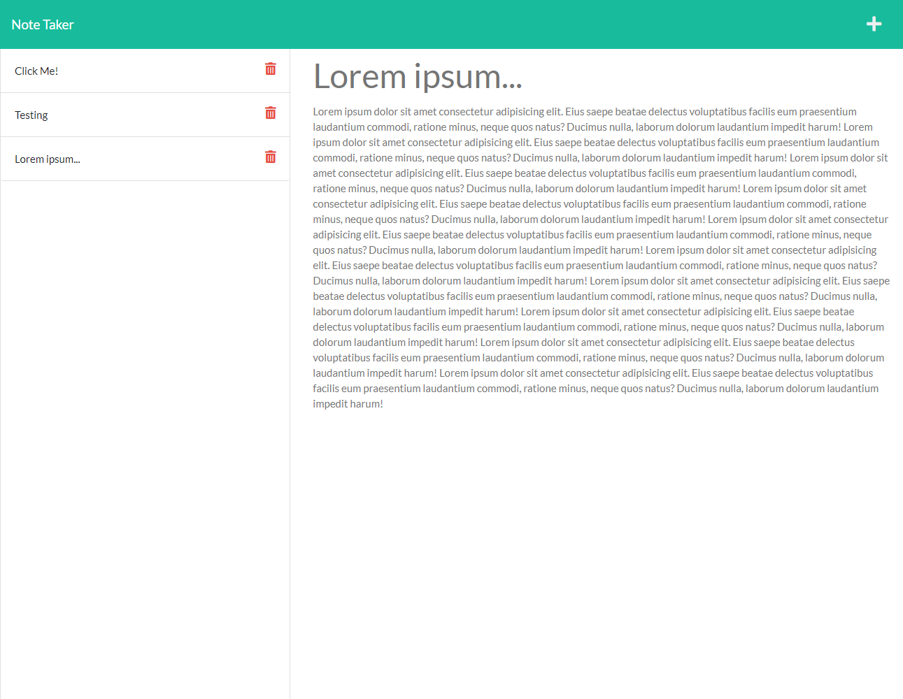

# Notebook

## Description
Notebook is a public, online note-taking app. You can post messages to it, read previous messages, and delete messages.
## Table of Contents
- [Installation](#installation)
- [Usage](#usage)
- [Questions](#questions)
## Installation
This project requires Node.js. With Node installed, type **npm install** or **npm i** in your terminal to install the dependencies.
## Usage
To start the server, type **npm run start** in the terminal. You can then connect to it on [localhost:3000](http://localhost:3000/). You may also run an auto-restarting server during further development by typing **npm run watch**
## Questions
If you have any questions about this project, you can find me on GitHub as [jcpickens0215](https://github.com/jcpickens0215).

## Screenshot

## License

Licensed under the [MIT License](https://mit-license.org/)
, copyright 2021 by Justin Pickens
____

Badges provided by [Shields.io](https://shields.io/)